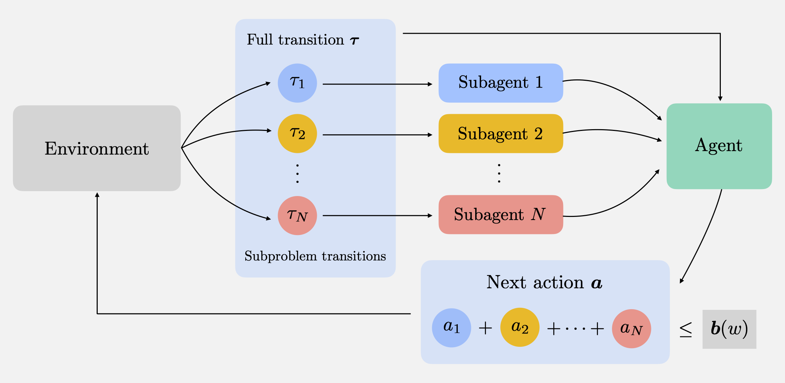

# WCDQN

To rerun the experiments for an evironment cd to the environment folder first then run job.slurm file on a cluster. To plot the results run the plot_results.py file.

# Weakly Coupoled Deep Q-Networks
**Authors:** Ibrahim El Shar and Daniel Jiang 

This is the source code for our paper "Weakly Coupoled Deep Q-Networks" published at NeurIPS 2023.

## Description
 We propose Weakly Coupled Deep Q-Networks (WCDQN) a new deep RL algorithm for weakly coupled MDPs.

   

## Citation
You can use the following Bibtex entry to cite our paper:
~~~bib
@inproceedings{el2023weakly,
  title={Weakly Coupled Deep Q-Networks},
  author={El Shar, Ibrahim and Jiang, Daniel R},
  booktitle={Thirty-seventh Conference on Neural Information Processing Systems},
  year={2023}
}
~~~  
  Installation
-------------
Code was tested on Python version 3.10

Build a working python enviromnent for e.g. using [Anaconda](https://www.anaconda.com/).

Install packages from `requirements.txt`

Clone this repo: 

~~~bash
	git clone https://github.com/ibrahim-elshar/WCDQN_NeurIPS.git
~~~
		
## Instructions
There are three environments organized in folders inside `src`: EV charging, multi-product inventory control, and Online stochastic ad matching. Each environment is  placed in a separate folder.

Each folder contains:
- Environment file, e.g. `carsharing.py` for `2-CS`. Running this file will produce the optimal Q-value `Qstar.pkl` if applicable.
- `agents.py` file that contains the code for `QL, Double-QL, SQL, BCQL` and `LBQL` algorithms. 
- `run.py` file which re-runs the experiments for the environment and reproduce the performance and relative error plots.

Hyperparameters for an algorithm can be set by chaninging the corresponding class default parameters in `agents.py` file.

`python agents.py` will produce `LBQL` vs `QL` bounds plots.

To rerun the experiments for an evironment cd to the environment folder first then:
~~~
$ python run.py
~~~

